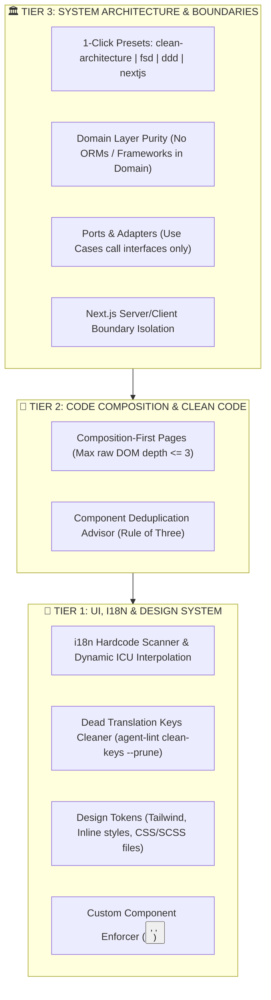

# agent-lint

<p align="center">
  <strong>AI-Native Codebase & Architecture Governance Engine for React, Next.js & Fullstack TypeScript</strong>
</p>

<p align="center">
  <a href="https://github.com/vucongchien/agent-lint/actions/workflows/ci.yml"></a>
  <a href="https://github.com/vucongchien/agent-lint/actions"></a>
  <a href="https://www.npmjs.com/package/agent-lint"></a>
  <a href="https://github.com/vucongchien/agent-lint/blob/main/LICENSE"></a>
  <a href="https://www.typescriptlang.org/"></a>
</p>

---

## 💡 Overview

Modern TypeScript, React & Next.js codebases frequently suffer from **architectural drift** and **front-end inconsistencies**, especially when developed alongside AI coding assistants:

1. **Architectural Drift & Leaks:** Database ORMs/framework decorators polluting pure Domain models, Use Cases bypassing Ports & Adapters, or server secrets leaking into Client Components (`'use client'`).
2. **Hardcoded UI Strings & Dynamic Templates:** Unextracted copy in JSX and complex dynamic strings (`` `Hello ${user.name}` ``) preventing seamless localization (i18n).
3. **Ad-hoc Styling & Design System Violations:** Rogue hex colors (`#1e293b`), arbitrary pixel values (`p-[15px]`), and raw HTML tags (`<button>`, `<a>`, ``) bypassing Design System components.
4. **Spaghetti Page Composition & Component Duplication:** Overly nested raw HTML in `page.tsx` and duplicated JSX skeletons copy-pasted across files.

**`agent-lint`** is a unified AST analysis & automated governance engine designed to enforce enterprise engineering standards across all 3 tiers of your application with **zero false positives**, **1-Click Architecture Presets**, and **AI Agent native workflows**.

---

## 🏗️ 3-Tier Governance Architecture



---

## ✨ Key Features

### 🏛️ 1. 1-Click Architecture Presets
Apply international architectural standards instantly with a single config line:
* **`preset: "clean-architecture"`**: Enforces $\text{Presentation} \rightarrow \text{Application} \rightarrow \text{Domain} \leftarrow \text{Infrastructure}$. Guarantees Domain entities remain pure TypeScript without ORMs (`@prisma/*`, `typeorm`, `mongoose`) or HTTP clients.
* **`preset: "fsd"` (Feature-Sliced Design)**: Enforces strict unidirectional flow from $\text{shared} \rightarrow \text{entities} \rightarrow \text{features} \rightarrow \text{widgets} \rightarrow \text{pages} \rightarrow \text{app}$.
* **`preset: "ddd"`**: Enforces Domain purity and ensures Domain Events remain free from Message Broker side-effects (`kafkajs`, `amqplib`, `ioredis`).
* **`preset: "nextjs"`**: Automatically guards against server secrets leaking into Client Components (`'use client'`).
* **Smart Type Exemption (`allow_type_imports: true`)**: Permissive toward pure TypeScript `import type { User } from '@/entities/user'` while strictly prohibiting runtime state/code couplings.

### ⚡ 2. Direct i18n Auto-Sync & Dynamic ICU Interpolation
* Automatically extracts static JSX strings and dynamic template literals:
  - `` `Xin chào ${user.name}, bạn có ${count} thông báo` `` $\longrightarrow$ `{t('xin_chao_name_ban_co_count_thong_bao', { name: user.name, count })}` + `"Xin chào {name}, bạn có {count} thông báo"`.
* Auto-injects `useTranslations()` / `useTranslation()` hooks and updates your JSON dictionary files (`locales/en.json`, `messages/vi.json`) in real time.

### 🧹 3. Dead Translation Keys Cleaner
* Scans your entire codebase to find unused translation keys in your dictionary files.
* Automatically prunes orphaned keys with `agent-lint clean-keys --prune`.

### 🎨 4. Design Tokens & Custom Component Enforcer
* Flags arbitrary colors (`bg-[#1e293b]`), spacing (`p-[15px]`), and fonts in Tailwind classes, inline styles, and `.css`/`.scss`/`.module.css` stylesheet files.
* Recommends closest matching tokens via $\Delta E$ (CIEDE2000) weighted color distance matching.
* Restricts raw HTML tags (`<button>`, `<a>`, ``) and auto-replaces them with Design System Custom Components (`<Button>`, `<Link>`, `<Image>`).

### 📐 5. Clean Page Composition & Component Deduplication
* **Composition-First Pages**: Ensures Next.js `page.tsx` and `layout.tsx` focus on composing high-level components rather than deeply nested raw DOM markup (max nesting depth $\le 3$).
* **Rule of Three Deduplication**: Detects duplicate layout skeletons across components (AST subtree fingerprinting + Jaccard CSS class similarity $\ge 80\%$) and suggests refactoring into reusable variant components once repeated $\ge 3$ times.

### 🤖 6. AI Agent Native & OASIS SARIF v2.1.0
* Built-in `--format=agent` output generates structured, actionable refactoring prompts optimized for LLM coding agents (Antigravity, Cursor, Claude Code).
* Supports **OASIS SARIF v2.1.0** for seamless integration with `oxlint` and GitHub CodeQL.

---

## 📦 Installation

```bash
# pnpm
pnpm add -D agent-lint @chien_swe/core eslint-plugin-agent-lint

# npm
npm install --save-dev agent-lint @chien_swe/core eslint-plugin-agent-lint

# yarn / bun
yarn add -D agent-lint @chien_swe/core eslint-plugin-agent-lint
bun add -d agent-lint @chien_swe/core eslint-plugin-agent-lint
```

---

## 🚀 Quick Start & CLI Cheatsheet

```bash
# 1. Initialize configuration with smart auto-detection
npx agent-lint init

# 2. Scan codebase (terminal output)
npx agent-lint scan

# 3. Output actionable prompt for AI Agents (Cursor / Claude)
npx agent-lint scan --format=agent

# 4. Generate SARIF report for GitHub CodeQL / Oxlint
npx agent-lint scan --format=sarif --output=report.sarif

# 5. Automatically fix violations & sync translation files
npx agent-lint fix

# 6. Detect and prune dead translation keys
npx agent-lint clean-keys --prune
```

---

## ⚡ Visual Demos & Code Examples (Before vs After)

### 1. ⚡ 1-Second Auto-Fix (i18n, Dynamic ICU, Design Tokens & Custom Component)
Run `npx agent-lint fix` to turn ad-hoc dirty markup into clean, localized, design-system compliant code:

```tsx
// ❌ BEFORE (Ad-hoc strings, dynamic template literals, rogue hex colors, raw HTML tags)
export function UserProfileHeader({ user, unreadCount }) {
  return (
    <div className="bg-[#1e293b] p-[15px]">
      <h1>{`Xin chào ${user.name}, bạn có ${unreadCount} thông báo mới!`}</h1>
      <button onClick={user.logout}>Đăng xuất</button>
    </div>
  );
}
```
$$\Big\Downarrow \text{ npx agent-lint fix }$$
```tsx
// ✅ AFTER (Auto-injected hooks, ICU dynamic parameters, nearest Tailwind token, Design System Button)
import { useTranslations } from 'next-intl';
import { Button } from '@/components/ui/button';

export function UserProfileHeader({ user, unreadCount }) {
  const t = useTranslations();
  return (
    <div className="bg-slate-800 p-4">
      <h1>{t('xin_chao_name_ban_co_unread_count_thong_bao_moi', { name: user.name, unreadCount })}</h1>
      <Button onClick={user.logout}>{t('dang_xuat')}</Button>
    </div>
  );
}
```
```json
// 📁 messages/vi.json (Automatically appended in real-time)
{
  "xin_chao_name_ban_co_unread_count_thong_bao_moi": "Xin chào {name}, bạn có {unreadCount} thông báo mới!",
  "dang_xuat": "Đăng xuất"
}
```

---

### 2. 🏛️ Architectural Boundary & Domain Purity Governance
Instantly catch AI coding assistants contaminating pure Domain layers or leaking Server secrets into Client Components:

```typescript
// ❌ src/domain/entities/Order.ts (AI contaminated Domain with TypeORM/Prisma)
import { Entity, Column } from 'typeorm'; // 🚨 PROHIBITED IN DOMAIN

// ❌ src/app/dashboard/profile.client.tsx (Secret server leak in Client Component)
"use client";
import { prisma } from '@/lib/db'; // 🚨 PROHIBITED IN CLIENT COMPONENT
```
```text
  error  src/domain/entities/Order.ts:1:1
         ↳ Domain Purity Violation: Layer "domain" is prohibited from importing "typeorm".
         ↳ Rule: Domain layer must remain pure TypeScript without ORM/framework dependencies.

  error  src/app/dashboard/profile.client.tsx:2:1
         ↳ Server/Client Boundary Violation: Client Component cannot import server module "@/lib/db".
```

---

### 3. 📐 Composition-First Pages & Layouts (No Spaghetti Pages)
Enforces that `page.tsx` acts solely as an orchestrator of high-level components:

```tsx
// ❌ src/app/dashboard/page.tsx (Spaghetti Markup: 5-level deep raw HTML)
export default function Page() {
  return (
    <main><div><section><div><ul><li>Deep Nested List</li></ul></div></section></div></main>
  );
}
```
```text
  warn   src/app/dashboard/page.tsx:3:5
         ↳ Composition Violation: Page contains deeply nested raw HTML (depth: 5 > max: 3).
         ↳ Suggestion: Refactor raw HTML blocks into dedicated custom components (<DashboardStats />, <RecentActivity />).
```

---

## ⚙️ Configuration (`.agent-lint.yaml`)

```yaml
version: "1.0"

# 1-Click Architecture Preset: "nextjs" | "clean-architecture" | "fsd" | "ddd" | "custom"
preset: "nextjs"

target:
  include:
    - "src/**/*.{tsx,jsx,ts,js}"
  exclude:
    - "**/*.test.{tsx,jsx,ts,js}"
    - "**/node_modules/**"
    - "**/.next/**"
    - "**/dist/**"

rules:
  # 1. i18n Hardcode Extraction & ICU Message Format
  i18n:
    enabled: true
    severity: "error"
    locales:
      dir: "auto" # Auto-detects 'messages', 'locales', 'src/locales'
      default: "auto"
      supported: "auto"
      file_format: "json"
    integration:
      framework: "auto" # Auto-detects 'next-intl' vs 'react-i18next'
      hook_name: "useTranslations"
      function_name: "t"
      auto_import: true
    key_generation:
      strategy: "slug"
      max_length: 40
    attributes:
      - "placeholder"
      - "title"
      - "alt"
      - "aria-label"

  # 2. Design Tokens & Custom Components
  design_tokens:
    enabled: true
    severity: "warn"
    provider: "tailwind"
    enforce:
      colors: true
      spacing: true
      font_sizes: true
    suggestion:
      auto_suggest: true
      color_tolerance: 0.85

    enforce_components:
      enabled: true
      severity: "error"
      restricted_elements:
        button:
          use: "Button"
          from: "@/components/ui/button"
          message: "Please use <Button /> from Design System instead of raw <button> tag."
        a:
          use: "Link"
          from: "next/link"
          message: "Please use <Link /> from next/link for client-side navigation."
        img:
          use: "Image"
          from: "next/image"

  # 3. Clean Architecture: Composition-First Pages
  clean_composition:
    enabled: true
    severity: "warn"
    targets:
      - "**/page.{tsx,jsx}"
      - "**/layout.{tsx,jsx}"
    max_raw_jsx_depth: 3
    max_raw_element_ratio: 0.6

  # 4. Component & Layout Deduplication (Rule of Three)
  component_deduplication:
    enabled: true
    severity: "warn"
    min_occurrences: 3
    min_element_count: 4
    similarity_threshold: 0.80

  # 5. Architecture & Layer Boundary Governance
  architecture:
    enabled: true
    preset: "nextjs"
    severity: "error"
    allow_type_imports: true
    server_client_boundary:
      enabled: true
      disallowed_imports:
        - "@/lib/db"
        - "prisma"
        - "@prisma/client"
        - "server-only"
        - "fs"
        - "path"
```

---

## 🔌 ESLint & Oxlint Integration

### 1. ESLint 9 Flat Config (`eslint.config.mjs`)
```js
import agentLint from 'eslint-plugin-agent-lint';

export default [
  {
    plugins: {
      'agent-lint': agentLint,
    },
    rules: {
      'agent-lint/no-hardcoded-i18n': 'error',
      'agent-lint/enforce-design-tokens': 'warn',
    },
  },
];
```

### 2. High-Speed CI with Oxlint & GitHub CodeQL
```yaml
# .github/workflows/lint.yml
- name: Run Oxlint & Agent-Lint
  run: |
    npx oxlint .
    npx agent-lint scan --format=sarif --output=agent-lint.sarif

- name: Upload SARIF report to GitHub Security
  uses: github/codeql-action/upload-sarif@v3
  with:
    sarif_file: agent-lint.sarif
```

---

## 🧪 Testing & Quality Assurance

```bash
# Run unit tests across all 19 test suites
pnpm test

# Build monorepo packages
pnpm build
```

---

## 📄 License

MIT © [vucongchien](https://github.com/vucongchien)
